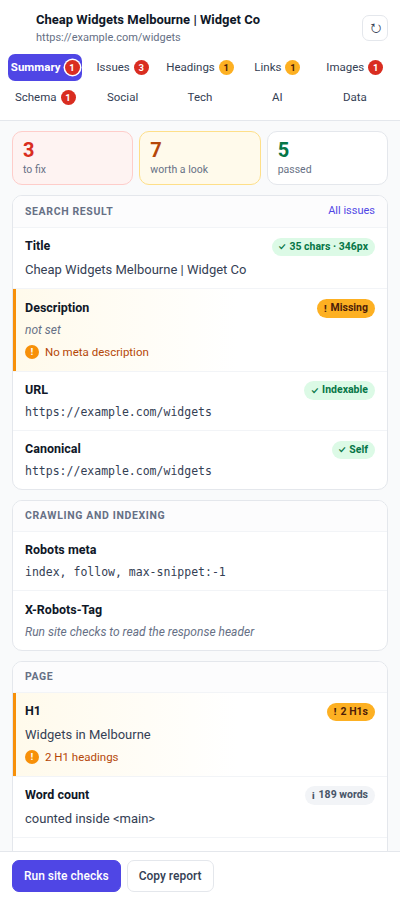
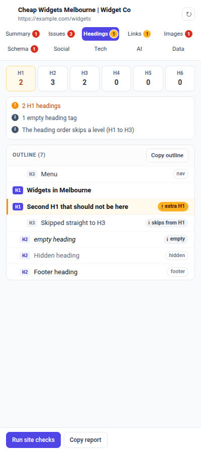
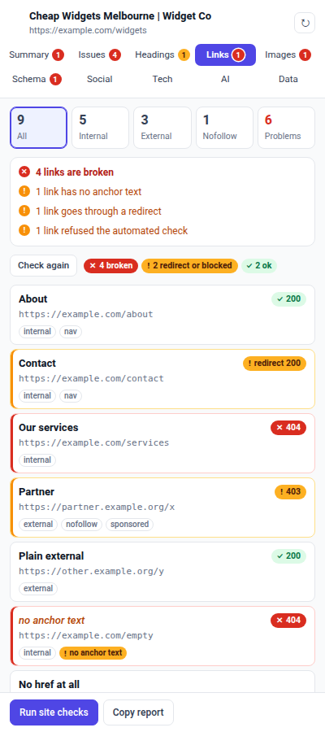

# SEO Xray, a free on-page SEO Chrome extension

SEO Xray is a Chrome side panel that audits the page you are looking at, using
the page's own code. No account, no API key, no server, no AI. Open a page, the
panel reads it, and you get a list of what is wrong with a fix written next to
each finding.

A Summary page puts the title, description, URL, canonical, robots directives,
H1 and word count in one place, each with a coloured pill: red when it is broken,
amber when it is worth a look, green when it is fine. Headings, Links, Images,
Schema and Social each get their own page, with every row marked the same way.

It answers two questions most SEO extensions skip. What does Google actually
receive from this URL, and what do ChatGPT, Claude and Perplexity receive, which
is usually not the same thing.

[](LICENSE)


| Summary | Headings | Links |
| --- | --- | --- |
|  |  |  |

## Install

Not on the Chrome Web Store yet. Load it unpacked, which takes about twenty
seconds:

1. Download this repository, or `git clone` it
2. Open `chrome://extensions`
3. Turn on **Developer mode**, top right
4. Click **Load unpacked** and pick the folder
5. Pin the toolbar icon, click it on any page

Chrome 114 or newer, because the side panel API landed in 114.

## What it checks

**On-page SEO.** Title and meta description with real rendered pixel widths
rather than character counts, canonical, meta robots, X-Robots-Tag, viewport,
lang, charset, heading outline with skipped levels flagged, internal and
external links, nofollow, images without alt text, Open Graph and Twitter cards,
hreflang pairs.

**Links, with status.** Every link with its anchor text, internal or external,
nofollow, sponsored and ugc, links with no anchor text, and a Check status button
that marks each one 200, redirect, 403 or 404. A 403 or 429 is shown in amber
rather than called broken, because it is usually a site blocking scripts.

**Images.** Missing alt, empty alt, missing width and height, files far larger
than they are shown, lazy loading above the fold, and images that failed to load.

**Structured data.** Every JSON-LD block on the page, parsed. A block with a
trailing comma is ignored by Google in silence, so the panel tells you which one
failed and where the syntax error is.

**Indexing.** Whether this URL is listed in the site's own XML sitemap, what
robots.txt says about it per crawler, and whether a directive somewhere is
quietly keeping the page out of the index.

**AI search readiness.** The extension fetches the raw HTML the server sends and
compares it against the rendered DOM. GPTBot, ClaudeBot, PerplexityBot and CCBot
do not run JavaScript, so anything that only exists after hydration is invisible
to them. It also reads llms.txt, checks per-crawler robots.txt rules, and can
repeat the request with a crawler's user agent to catch a CDN or WAF turning
those crawlers away.

**Tech and tracking.** 80 tracker signatures with their container and property
IDs pulled out, CMS, theme, page builder, SEO plugin, JavaScript framework, site
verification tags, social profiles, third party hosts, and a security header
grade.

## Why another SEO extension

| | SEO Xray | Typical SEO toolbar |
| --- | --- | --- |
| Account or login | none | usually required |
| Sends the URL you visit to a server | never | usually |
| Metrics from a third party index | none | the main feature |
| Raw HTML vs rendered DOM diff | yes | rare |
| Per-crawler robots.txt rules | yes | rare |
| Crawler user agent probe | yes | rare |
| Every finding carries a fix | yes | sometimes |
| Price | free, MIT | freemium |

The trade is deliberate. You will not get Domain Rating or backlink counts here,
because a browser cannot produce those without calling somebody else's paid API.
What you get is everything that can be read from the page itself, read properly.

## Privacy

Reading the page happens locally and automatically. Nothing is transmitted.

Two buttons touch the network. **Run site checks** requests only from the site
you are already on: its raw HTML, its robots.txt, its llms.txt, its sitemap.
**Check status** on the Links tab sends a HEAD request to each link on the page,
without cookies. Nothing else requests anything, and images from the page are
never loaded into the panel. There is no
analytics, no telemetry, no remote code, no account, and nothing is stored off
your machine. See [PRIVACY.md](PRIVACY.md).

## Permissions, and why each one is there

| Permission | Why |
| --- | --- |
| `sidePanel` | the panel is the whole interface |
| `scripting` | runs the reader inside the tab to take a snapshot |
| `tabs` | knows which tab you are on and when you navigate |
| `storage` | remembers which tab of the panel you had open |
| `declarativeNetRequestWithHostAccess` | sets a crawler user agent on the optional probe request |
| `<all_urls>` | you can audit any page, robots.txt can be fetched from any host, and links to any host can be checked |

`<all_urls>` is a wide grant and worth understanding before you install anything
that asks for it. Here it is what lets the panel read whichever tab you happen to
be on. The code that uses it is in `src/extract.js` and `src/fetchers.js`, both
short enough to read in a sitting.

## Questions

**Does it use AI?** No. Every finding comes from a rule you can read in
`src/checks.js` or `src/aiready.js`. Nothing is sent to a language model and
there is no API key to configure.

**Does it slow pages down?** It does not touch page load at all. The snapshot is
taken after the page is ready. On a 5,400 node page the read takes about 32ms.

**Why fetch raw HTML instead of reloading with JavaScript disabled?** A JS-off
reload loses form state, needs an extra permission, and still cannot show you a
CDN blocking GPTBot specifically. Fetching the served HTML is exactly what a
non-rendering crawler receives, and the same request can be repeated with a
crawler user agent.

**Why are title and meta measured in pixels?** Google truncates on width, not
character count. A 60 character title in wide letters gets cut, a 65 character
one in narrow letters does not.

**Does it work on localhost and staging sites?** Yes. Nothing is phoned home, so
a site behind a login or on a local port audits the same as a live one.

**Will it tell me my rankings?** No, and nothing that runs purely in a browser
honestly can.

## How it is built

```
manifest.json           permissions and side panel registration
background.js           opens the panel when the toolbar icon is clicked
panel.html/css/js       the interface. Never uses innerHTML
src/extract.js          the reader. One function, two callers: the live tab,
                        and raw HTML parsed inside the panel
src/extract-inject.js   the wrapper that runs the reader inside a tab
src/checks.js           on-page SEO rules
src/robots.js           robots.txt parser and matcher, RFC 9309 rules
src/fetchers.js         raw HTML, robots.txt, llms.txt, sitemap membership
src/aiready.js          AI crawler readiness scoring
src/tech.js             trackers, CMS, builders, socials, security headers
src/catalogue.js        signature catalogue
tests/                  node and Playwright checks against fixtures with
                        known faults
```

One rule keeps the codebase honest: `extract.js` measures and never judges. It
returns raw values only. Every "this is a problem" decision lives in a pure
module that takes a snapshot and returns findings, so a saved snapshot can be
re-scored later without revisiting the site, and every rule tests in node with no
browser attached.

A finding that cannot say what to do about it does not get written.

Everything the panel displays came from a site nobody controls, so nothing is
ever written with `innerHTML`. Text goes in through `textContent`, always.

## Tests

```bash
python3 tests/run.py
```

511 checks. Playwright and Python 3 are needed for the browser tests.

| file | what it covers |
| --- | --- |
| `build_test.py` | the folder loads: manifest, icons, referenced files, no local paths or keys |
| `extract_test.py` | the reader against a fixture page built with known faults |
| `checks_test.js` | every on-page rule, both the firing and the not-firing case |
| `robots_test.js` | the matcher against the RFC rules and malformed input |
| `tech_test.js` | signatures, CMS detection, and the false positives already fixed once |
| `aiready_test.js` | the raw versus rendered comparison and crawler access |
| `panel_test.py` | the real panel, all ten pages, with a stubbed browser and a stubbed network |
| `perf_test.py` | a deliberately heavy page held to a time budget |

`tests/fixtures/messy.html` is a page with faults on purpose: two H1s, a skipped
heading level, a missing alt, broken JSON-LD, no meta description, no viewport, a
tag manager, a dead-end anchor, and image files that do not exist.

Panel tests write screenshots to `tests/ui-*.png`. Look at them rather than
trusting a green tick.

## Speed

On a 5,400 node page: read 34ms, score 16ms, draw 45ms, switch to the 1,800 link Links tab 11ms.
Long lists draw 120 rows at a time.
`perf_test.py` holds those to a budget, so a change that makes the panel sluggish
fails the suite instead of being noticed months later.

## Roadmap

- [x] Side panel, snapshot reader, on-page rules with fix text
- [x] robots.txt matcher, sitemap membership, raw vs rendered, llms.txt, crawler
      user agent probes
- [x] Tech and tracking detection
- [x] Tabbed interface, severity filters, copy report, speed budget
- [x] Summary page with red, amber and green status pills; Headings, Links,
      Images, Schema and Social pages; link status checking
- [ ] Highlight overlay: paint headings, nofollow links and missing alt on the
      live page
- [ ] Chrome Web Store listing

## Contributing

Adding a tracker signature means adding a pattern to `src/catalogue.js` and
running `node tests/tech_test.js`. Adding an SEO rule means adding it to
`src/checks.js` with both a firing and a not-firing test in
`tests/checks_test.js`. A rule without fix text will not be merged.

## License

MIT. See [LICENSE](LICENSE).

Built by [Puneet Singh](https://github.com/puneetindersingh).
